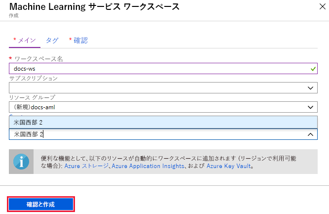

1. 使用する Azure サブスクリプションの資格情報を使って、[Azure portal](https://portal.azure.com/) にサインインします。 

1. Azure portal の左上隅にある **[リソースの作成]** を選択します。

1. 検索バーを使用して、**Machine Learning service ワークスペース**を見つけます。

1. **[Machine Learning service ワークスペース]** を選択します。

1. **[ML サービス ワークスペース]** ウィンドウで、 **[作成]** を選択して開始します。

1. ワークスペースの名前、サブスクリプション、リソース グループ、場所を指定し、新しいワークスペースを構成します。

    

   フィールド|説明 
   ---|---
   ワークスペース名 |ワークスペースを識別する一意名を入力します。 この例では、**docs-ws** を使用します。 名前は、リソース グループ全体で一意である必要があります。 覚えやすく、他のユーザーが作成したワークスペースと区別しやすい名前を使用します。  
   Subscription |使用する Azure サブスクリプションを選択します。
   Resource group | サブスクリプションの既存のリソース グループを使用するか、任意の名前を入力して新しいリソース グループを作成します。 リソース グループは、Azure ソリューションの関連するリソースを保持します。 この例では、**docs-aml** を使用します。 
   Location | ユーザーとデータ リソースに最も近い場所を選択し、ワークスペースを作成します。

1. ワークスペースの構成が完了したら、 **[作成]** を選択します。 

   ワークスペースの作成には、しばらく時間がかかる場合があります。

   プロセスが完了すると、デプロイ成功メッセージが表示されます。 このメッセージは、通知セクションにも表示されます。 新しいワークスペースを表示するには、 **[Go to resource]\(リソースに移動\)** を選択します。

   

1. ビジュアル インターフェイスや自動 ML 実験など、ポータルからコーディング不要のオプションを使用する場合は、これで完了です。 [Notebook VM](../articles/machine-learning/service/tutorial-1st-experiment-sdk-setup.md#azure) を作成する場合も、これで完了です。 

1. このワークスペースを参照するローカル環境でコードを使用する場合は、ワークスペースの **[概要]** セクションから **[config. json をダウンロード]** を選択します。  

   
   
   このファイルは、Python スクリプトまたは Jupyter Notebook を含むディレクトリ構造内に置きます。 それは、同じディレクトリ内、 *.azureml* という名前のサブディレクトリ内、または親ディレクトリ内に置くことができます。 Notebook VM を作成するとき、このファイルは VM 上の正しいディレクトリに自動的に追加されます。

    

