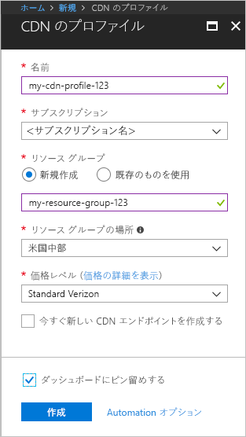

## 新しい CDN プロファイルを作成する

CDN プロファイルは、CDN エンドポイントのコンテナーであり、価格レベルを指定します。

1. Azure Portal の左上隅にある **[リソースの作成]** を選択します。
    
    **[新規]** ウィンドウが表示されます。
   
2. **[Web + モバイル]**、**[CDN]** の順に選択します。
   
    

    **[CDN のプロファイル]** ウィンドウが表示されます。

    画像の下の表に指定した設定を使用してください。
   
    

    | Setting  | 値 |
    | -------- | ----- |
    | **名前** | プロファイル名として「*my-cdn-profile-123*」と入力します。 この名前はグローバルに一意でなければなりません。この名前が既に使用されている場合は、別の名前を入力してください。 |
    | **サブスクリプション** | ドロップダウン リストから Azure サブスクリプションを選択します。|
    | **[リソース グループ]** | **[新規作成]** を選択し、リソース グループ名として「*my-resource-group-123*」と入力します。 この名前はグローバルに一意でなければなりません。この名前が既に使用されている場合は、別の名前を入力してください。 | 
    | **リソース グループの場所** | ドロップダウンから **[米国中部]** を選択します。 |
    | **[価格レベル]** | ドロップダウンから **[Standard Verizon]** を選択します。 |
    | **今すぐ新しい CDN エンドポイントを作成する** | オフのままにします。 |  
   
3. プロファイルを作成後にダッシュボードに保存するには、**[ダッシュボードにピン留め]** をオンにします。
    
4. **[作成]** を選択してプロファイルを作成します。 

