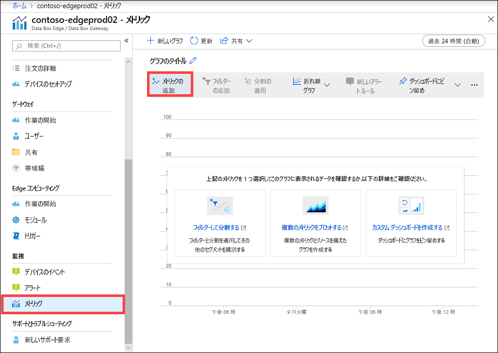
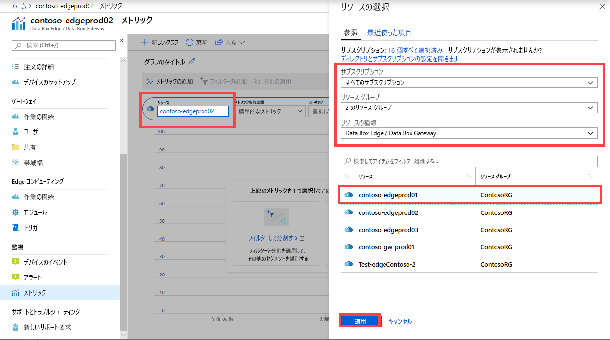
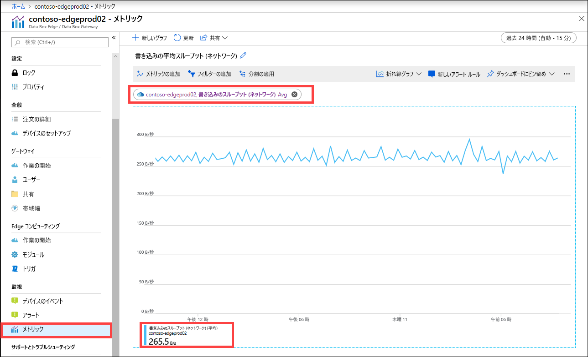

メトリックも表示することで、デバイスのパフォーマンスを監視したり、場合によっては、デバイスの問題のトラブルシューティングを行ったりできます。

選択したデバイス メトリックのグラフを作成するには、Azure portal 内で次の手順を実行します。

1. ご利用のリソースの場合は、Azure portal 内で、**[監視] > [メトリック]** に移動し、**[メトリックの追加]** を選択します。

    

2. リソースは自動的に設定されます。  

    

    別のリソースを指定するには、そのリソースを選択します。 **[リソースの選択]** ブレードで、サブスクリプション、リソース グループ、リソースの種類、およびメトリックを表示する特定のリソースを選択し、**[適用]** を選択します。

    

3. ドロップダウン リストから、ご自分のデバイスを監視するためのメトリックを選択します。 メトリックには、**容量メトリック**または**トランザクション メトリック**があります。 容量メトリックは、デバイスの容量に関連しています。 トランザクション メトリックは、Azure Storage に対するすべての読み取り操作と書き込み操作に関連しています。

    |容量メトリック                     |説明  |
    |-------------------------------------|-------------|
    |**使用可能な容量**               | デバイスに書き込むことができるデータのサイズを示します。 つまり、これはデバイス上で使用できる容量です。   デバイスとクラウドの両方にコピーがあるファイルのローカル コピーを削除することで、デバイスの容量を解放できます。        |
    |**合計容量**                   | データを書き込むデバイス上の合計バイト数を示します。 これは、ローカル キャッシュの合計サイズとも呼ばれます。    データ ディスクを追加することで、既存の仮想デバイスの容量を増やすことができるようになりました。 VM のハイパーバイザー管理からデータ ディスクを追加した後、ご自分の VM を再起動します。 新しく追加されたデータ ディスクに合わせて、ゲートウェイ デバイスのローカル記憶域プールが拡張されます。   詳細については、[Hyper-V 仮想マシンのハード ドライブの追加](https://www.youtube.com/watch?v=EWdqUw9tTe4)に関する動画を参照してください。 |
    
    |トランザクション メトリック              | 説明         |
    |-------------------------------------|---------|
    |**Cloud bytes uploaded (device) \(クラウドのアップロードされたバイト数 (デバイス)\)**    | ご自分のデバイス上にあるすべての共有からアップロードされたすべてのバイト数の合計        |
    |**Cloud bytes uploaded (share) \(クラウドのアップロードされたバイト数 (共有)\)**     | 共有あたりのアップロードされたバイト数。 これは以下のマシンで行えます。    平均。これは、(共有あたりのアップロードされたすべてのバイト数の合計 / 共有の数) です    最大。これは、1 つの共有からアップロードされたバイトの最大数です   最小。これは、1 つの共有からアップロードされたバイトの最小数です      |
    |**Cloud download throughput (share) \(クラウドのダウンロード スループット (共有)\)**| 共有あたりのダウンロードされたバイト数。 これは以下のマシンで行えます。    平均。これは、(1 つの共有に読み取られた、またはダウンロードされたすべてのバイト数の合計 / 共有の数) です    最大。これは、1 つの共有にダウンロードされたバイトの最大数です   最小。これは、1 つの共有にダウンロードされたバイトの最小数です  |
    |**Cloud read throughput \(クラウドの読み取りスループット\)**            | クラウドからご自分のデバイス上にあるすべての共有に読み取られたすべてのバイト数の合計     |
    |**Cloud upload throughput \(クラウドへのアップロード時のスループット\)**          | ご自分のデバイス上にあるすべての共有からクラウドに書き込まれたすべてのバイト数の合計     |
    |**Cloud upload throughput (share) \(クラウドへのアップロード時のスループット (共有)\)**  | (共有からクラウドに書き込まれたすべてのバイト数の合計 / 共有の数) が共有あたりの平均で、最大と最小もあります      |
    |**Read throughput (network) \(読み取りスループット (ネットワーク)\)**           | クラウドから読み取られたすべてのバイトのシステム ネットワーク スループットが含まれます。 このビューには、共有に限定されないデータが含まれることがあります。   分割すると、デバイス上にあるすべてのネットワーク アダプターのトラフィックが表示されます。 これには、接続されていないアダプターと有効にされていないアダプターが含まれます。      |
    |**Write throughput (network) \(書き込みスループット (ネットワーク)\)**       | クラウドに書き込まれたすべてのバイトのシステム ネットワーク スループットが含まれます。 このビューには、共有に限定されないデータが含まれることがあります。   分割すると、デバイス上にあるすべてのネットワーク アダプターのトラフィックが表示されます。 これには、接続されていないアダプターと有効にされていないアダプターが含まれます。          |
    |**Edge コンピューティング - メモリ使用量**      | このメトリックは Data Box Gateway には適用されません。そのため、設定されません。          |
    |**Edge コンピューティング - CPU 使用率**    | このメトリックは Data Box Gateway には適用されません。そのため、設定されません。         |

4. ドロップダウン リストからメトリックを選択すると、集計を定義することもできます。 集計は、指定した期間にわたって集計された実際の値を示します。 集計値については、平均値、最小値、または最大値を選択できます。 [平均]、[最大]、または [最小] から集計を選択します。

    

5. 選択したメトリックに複数のインスタンスがある場合は、分割オプションを使用できます。 **[Apply splitting]\(分割の適用\)** を選択し、内訳を表示する値を選択します。

    ![[Apply splitting]\(分割の適用\)](media/data-box-edge-gateway-view-metrics/view-metrics-5.png)

6. いくつかのインスタンスのみの内訳を表示する場合は、データをフィルター処理できます。 たとえば、この場合に、ご自分のデバイス上にある接続されている 2 つのネットワーク インターフェイスのみのネットワーク スループットを表示するには、それらのインターフェイスをフィルター処理できます。 **[フィルターの追加]** を選択し、フィルター処理するネットワーク インターフェイスの名前を指定します。

    ![[フィルターの追加]](media/data-box-edge-gateway-view-metrics/view-metrics-6.png)

7. また、ダッシュボードにグラフをピン留めすると、簡単にアクセスできます。

    ![[ダッシュボードにピン留めする]](media/data-box-edge-gateway-view-metrics/view-metrics-7.png)

8. グラフのデータを Excel スプレッドシートにエクスポートしたり、共有できるグラフへのリンクを入手したりするには、コマンド バーから [共有] オプションを選択します。

    