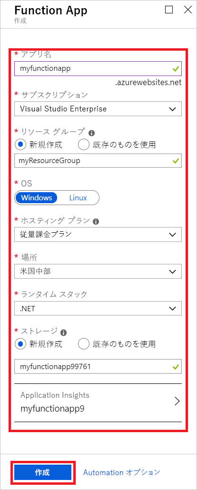
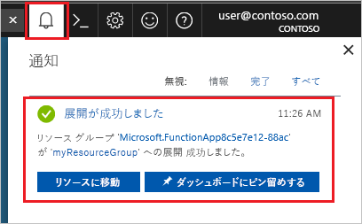

1. Azure Portal の左上隅にある **[新規]** ボタンを選択し、**[コンピューティング]** > **[Function App]** を選択します。

    

2. 図の下にある表に指定されている関数アプリの設定を使用します。

    

    | Setting      | 推奨値  | 説明                                        |
    | ------------ |  ------- | -------------------------------------------------- |
    | **アプリ名** | グローバルに一意の名前 | 新しい Function App を識別する名前。 有効な文字は、`a-z`、`0-9`、および `-` です。  | 
    | **サブスクリプション** | 該当するサブスクリプション | この新しい Function App が作成されるサブスクリプション。 | 
    | **[リソース グループ](../articles/azure-resource-manager/resource-group-overview.md)** |  myResourceGroup | Function App を作成するための新しいリソース グループの名前。 |
    | **OS** | Windows | サーバーなしのホスティングは、現時点では、Windows で実行される場合のみ使用できます。 Linux でのホスティングについては、「[Azure CLI を使用して Linux で実行する関数を初めて作成する](../articles/azure-functions/functions-create-first-azure-function-azure-cli-linux.md)」を参照してください。 |
    | **[ホスティング プラン](../articles/azure-functions/functions-scale.md)** | 従量課金プラン | Function App にどのようにリソースが割り当てられるかを定義するホスティング プラン。 既定の **[従量課金プラン]** では、リソースは関数の必要に応じて動的に追加されます。 この[サーバーなしの](https://azure.microsoft.com/overview/serverless-computing/) ホスティングでは、関数が実行された時間にのみ課金されます。 App Service プランで実行する場合は、[関数アプリのスケーリング](../articles/azure-functions/functions-scale.md)を管理する必要があります。  |
    | **場所** | 西ヨーロッパ | ユーザーに近い[リージョン](https://azure.microsoft.com/regions/)、または関数がアクセスする他のサービスの近くのリージョンを選択します。 |
    | **ランタイム スタック** | 優先言語 | お気に入りの関数プログラミング言語をサポートするランタイムを選択します。 C# および F# 関数用の **[.NET]** を選択します。 |
    | **[Storage](../articles/storage/common/storage-quickstart-create-account.md)** |  グローバルに一意の名前 |  関数アプリで使用されるストレージ アカウントを作成します。 ストレージ アカウント名の長さは 3 ～ 24 文字で、数字と小文字のみを使用できます。 既存のアカウントを使用することもできますが、[ストレージ アカウントの要件](../articles/azure-functions/functions-scale.md#storage-account-requirements)を満たしている必要があります。 |
    | **[Application Insights](../articles/azure-functions/functions-monitoring.md)** | 既定値 | Application Insights は、既定で有効になっています。 関数アプリの近くの場所を選択します。  |

3. **[作成]** を選択して、Function App をプロビジョニングし、デプロイします。

4. ポータルの右上隅の通知アイコンを選択し、"**デプロイメントに成功しました**" というメッセージが表示されるまで待ちます。

    

5. **[リソースに移動]** を選択して、新しい関数アプリを確認します。

> [!TIP]
> 目的の関数アプリがポータルに見つからない場合は、[Azure Portal のお気に入りに Function Apps を追加](../articles/azure-functions/functions-how-to-use-azure-function-app-settings.md#favorite)してみてください。
