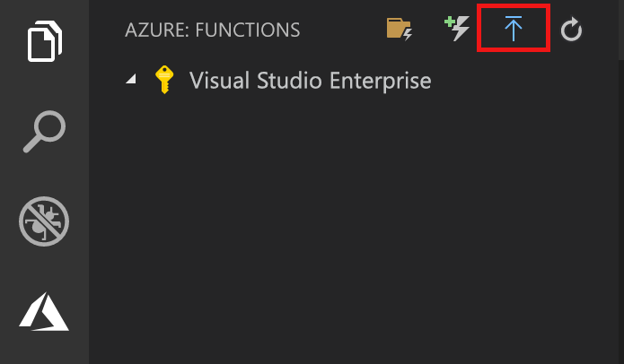

## Azure にプロジェクトを発行する

Visual Studio Code を使用すると、関数プロジェクトを Azure に直接発行できます。 このプロセスでは、Azure サブスクリプションに関数アプリと関連リソースを作成します。 関数アプリは、関数の実行コンテキストを提供します。 プロジェクトがパッケージ化され、Azure サブスクリプション内の新しい関数アプリにデプロイされます。

この記事では、新しい関数アプリを作成することを想定しています。 

> [!IMPORTANT]
> 既存の関数アプリに発行すると、Azure のそのアプリのコンテンツが上書きされます。

1. **[Azure: Functions]** 領域で、[Deploy to Function App]\(Function App にデプロイ\) アイコンを選択します。

    

1. サインインしていない場合、**Azure にサインイン**するよう求められます。 **無料の Azure アカウントを作成**することもできます。 ブラウザーから正常にサインインしたら、Visual Studio Code に戻ります。 

1. 複数のサブスクリプションがある場合、関数アプリ用の **[サブスクリプションを選択]** してから、 **[+ Create New Function App in Azure]\(+ Azure で新しい Function App を作成\)** を選択します。

1. 関数アプリを識別するグローバルに一意の名前を入力し、Enter キーを押します。 関数アプリ名の有効な文字は、`a-z`、`0-9`、`-` です。

1. **[+ 新しいリソース グループの作成]** を選択し、`myResourceGroup` のようなリソース グループ名を入力して、Enter キーを押します。 既存のリソース グループを使用することもできます。

1. **[+ 新しいストレージ アカウントの作成]** を選択し、関数アプリで使用する新しいストレージ アカウントのグローバルに一意の名前を入力して、Enter キーを押します。 ストレージ アカウント名の長さは 3 ～ 24 文字で、数字と小文字のみを使用できます。 既存のアカウントを使用することもできます。

1. 最寄りの[リージョン](https://azure.microsoft.com/regions/)または関数がアクセスする他のサービスの近くのリージョン内の場所を選択します。

    Enter キーを押すと、次の Azure リソースがサブスクリプションに作成されます。

    * **[リソース グループ](../articles/azure-resource-manager/resource-group-overview.md)** :作成された Azure リソースがすべて含まれます。 名前は関数アプリの名前に基づきます。
    * **[ストレージ アカウント](../articles/storage/common/storage-quickstart-create-account.md)** :関数アプリの名前に基づいた一意の名前で、Standard Storage アカウントが作成されます。
    * **[ホスティング プラン](../articles/azure-functions/functions-scale.md)** :サーバーレス関数アプリをホストするために、従量課金プランが米国西部リージョンに作成されます。
    * **関数アプリ**:プロジェクトはこの新しい関数アプリにデプロイされ、そこで実行されます。

    関数アプリが作成され、展開パッケージが適用されると、通知が表示されます。 この通知の **[View Output]\(出力の表示\)** を選択すると、作成済みの Azure リソースなど、作成とデプロイの結果が表示されます。

1. **[Azure: Functions]** 領域に戻り、サブスクリプションの下にある新しい関数アプリを展開します。 **[Functions]** を展開し、 **[HttpTrigger]** を右クリックして **[Copy function URL]\(関数 URL のコピー\)** を選択します。

    
