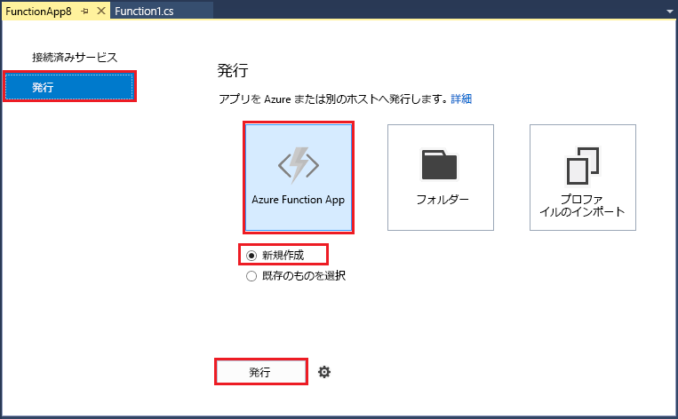
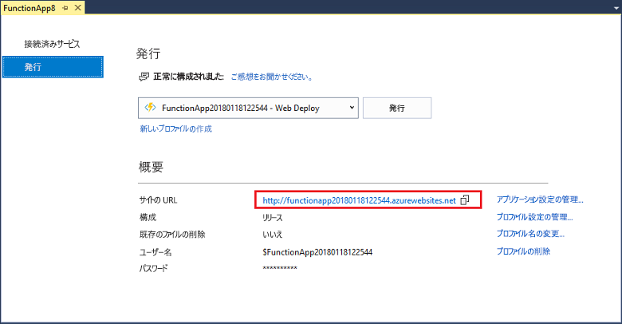

1. **ソリューション エクスプローラー**で、プロジェクトを右クリックし、**[発行]** を選択します。 **[新規作成]** を選択し、**[発行]** を選択します。 

    

2. まだ Visual Studio を Azure アカウントに接続していない場合は、**[アカウントの追加...]** を選択します。  

3. **[App Service の作成]** ダイアログでは、次の表に指定されているように**ホスティング**設定を使用してください。 

    

    | 設定      | 推奨値  | [説明]                                |
    | ------------ |  ------- | -------------------------------------------------- |
    | **アプリ名** | グローバルに一意の名前 | 新しい関数アプリを一意に識別する名前。 |
    | **サブスクリプション** | サブスクリプションの選択 | 使用する Azure サブスクリプション。 |
    | **[リソース グループ](../articles/azure-resource-manager/resource-group-overview.md)** | myResourceGroup |  関数アプリを作成するリソース グループの名前。 新しいリソース グループを作成する場合は、**[新規]** を選択します。|
    | **[App Service プラン](../articles/azure-functions/functions-scale.md)** | 従量課金プラン | **[新規]** をクリックして新しいプランを作成した後は、必ず **[サイズ]** の下の **[従量課金プラン]** を選択してください。 また、[[地域]](https://azure.microsoft.com/regions/) で、自分に近いか、または自分の関数がアクセスする他のサービスに近い **[場所]** を選択します。  |

    >[!NOTE]
    >Functions ランタイムには Azure Storage アカウントが必要です。 そのため、関数アプリを作成すると、新しい Azure Storage アカウントが作成されます。

4. **[作成]** をクリックして、これらの設定で Azure に関数アプリと関連リソースを作成し、関数プロジェクト コードをデプロイします。 

5. デプロイが完了したら、**[サイトの URL]** の値を書き留めておきます。これが Azure における関数アプリのアドレスになります。

    
