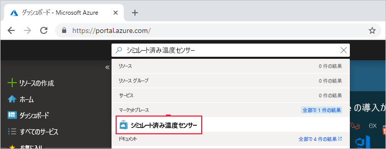
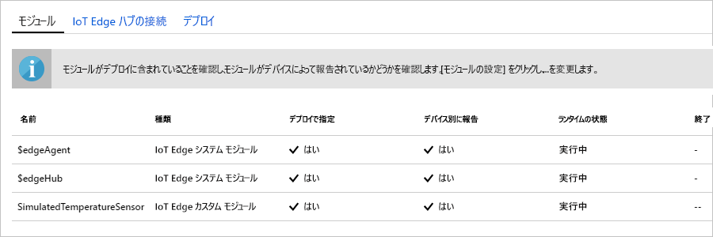

Azure IoT Edge の主要な機能の 1 つは、クラウドからお客様の IoT Edge デバイスにコードをデプロイできることです。 **IoT Edge モジュール**は、コンテナーとして実装されている実行可能ファイルのパッケージです。 このセクションでは、[Azure Marketplace の IoT Edge モジュールのセクション](https://azuremarketplace.microsoft.com/marketplace/apps/category/internet-of-things?page=1&subcategories=iot-edge-modules)から事前に構成したモジュールをデプロイします。 

このセクションでデプロイするモジュールはセンサーをシミュレートし、生成されたデータを送信します。 シミュレートされたデータを開発とテストに使用できるため、このモジュールは IoT Edge の使用を開始する際にコードの一部として役に立ちます。 このモジュールで行われる内容を正確に確認したい場合は、[シミュレートされた温度センサーのソース コード](https://github.com/Azure/iotedge/blob/027a509549a248647ed41ca7fe1dc508771c8123/edge-modules/SimulatedTemperatureSensor/src/Program.cs)をご覧いただけます。 

Azure Marketplace からお客様の最初のモジュールをデプロイするには、次の手順を使用します。

1. [Azure portal](https://portal.azure.com) で、「**Simulated Temperature Sensor**」と検索に入力し、Marketplace の結果を開きます。

   

2. モジュールを受け取る IoT Edge デバイスを選択します。 **[IoT Edge モジュールのターゲット デバイス]** ページで、次の情報を入力します。

   1. **サブスクリプション**: 使用している IoT ハブを含むサブスクリプションを選択します。

   2. **IoT Hub**: 使用している IoT ハブ の名前を選択します。

   3. **IoT Edge デバイス名**: このクイック スタートで提案されているデバイス名を使用した場合は、「**myEdgeDevice**」と入力します。 または、**[デバイスの検索]** を選択して、お客様の IoT ハブにある IoT Edge デバイスの一覧から選択します。 
   
   4. **作成** を選択します。

3. Azure Marketplace から IoT Edge モジュールを選択し、モジュールを受け取る IoT Edge デバイスを選択したところで、モジュールのデプロイ方法を正確に定義するために役立つ 3 つの手順のウィザードに進みます。 ウィザードの **[モジュールの追加]** 手順で、**SimulatedTemperatureSensor** モジュールが自動的に設定されていることに注目してください。 チュートリアルでは、このページを使用して他のモジュールをお客様のデプロイに追加します。 このクイック スタートでは、この 1 つのモジュールのみをデプロイします。 **[次へ]** を選択して、ウィザードの次の手順に進みます。

4. ウィザードの **[ルートの指定]** 手順で、モジュール間と IoT Hub に対してメッセージが渡される方法を定義します。 このクイック スタートでは、すべてのモジュールのすべてのメッセージを IoT Hub (`$upstream`) に送信します。 自動的に設定されていない場合は、次のコードを追加し、**[次へ]** を選択します。

   ```json
    {
    "routes": {
        "route": "FROM /messages/* INTO $upstream"
        }
    }
   ```

5. ウィザードの **[デプロイの確認]** 手順では、IoT Edge デバイスにデプロイされているすべてのモジュールを定義する JSON ファイルをプレビューできます。 **SimulatedTemperatureSensor** モジュールに加え、**edgeAgent** と **edgeHub** という 2 つの追加システム モジュールが含まれていることに注目してください。 確認が完了したら、**[送信]** を選択します。

   IoT Edge デバイスに新しいデプロイを送信しても、デバイスには何もプッシュされません。 代わりに、デバイスから IoT Hub に対して、新しい指示のクエリが定期的に実行されます。 更新されたデプロイ マニフェストがデバイスによって検出されると、新しいデプロイに関する情報が使用されてクラウドからモジュール イメージがプルされ、ローカルでのモジュールの実行が開始されます。 このプロセスは数分かかることがあります。 

6. モジュールのデプロイの詳細を送信すると、ウィザードは IoT ハブの **[IoT Edge]** ページに戻ります。 IoT Edge デバイスの一覧からデバイスを選択すると、その詳細が表示されます。 

7. デバイスの詳細ページで、**[モジュール]** セクションまで下にスクロールします。 $edgeAgent、$edgeHub、SimulatedTemperatureSensor という 3 つのモジュールが表示されているはずです。 デプロイで指定されたとおりに表示されているのにデバイスによってレポートされていないモジュールが 1 つ以上ある場合、それらはまだお客様の IoT Edge デバイスによって起動中です。 少し待ってから、ページの上部にある **[更新]** をクリックします。 

   
