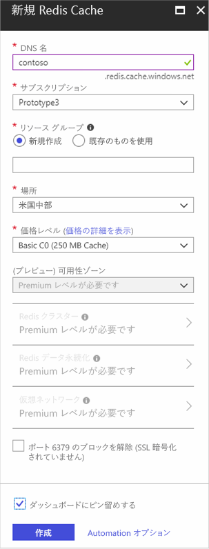
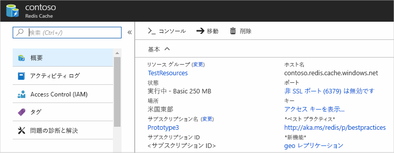

キャッシュを作成するには、最初にサインイン、 [Azure ポータル](https://portal.azure.com)、 をクリック**新規** > **データベース** > **Redis Cache**です。

> [!NOTE]
> Azure アカウントを持っていない場合は[無料の Azure アカウントを開く](https://azure.microsoft.com/pricing/free-trial/?WT.mc_id=redis_cache_hero)分の 2 回だけにします。
> 
> 

> [!NOTE]
> Azure ポータルでキャッシュの作成、に加えて作成することもリソース マネージャーを使用してテンプレート、PowerShell、または Azure CLI です。
> 
> * リソース マネージャーのテンプレートを使用してキャッシュを作成するを参照してください。[テンプレートを使用する Redis キャッシュの作成](../articles/redis-cache/cache-redis-cache-arm-provision.md)です。
> * Azure PowerShell を使用してキャッシュを作成するを参照してください。 [Azure PowerShell での Azure Redis Cache の管理](../articles/redis-cache/cache-howto-manage-redis-cache-powershell.md)です。
> * Azure CLI を使用してキャッシュを作成するを参照してください。[を作成し、Azure コマンド ライン インターフェイス (Azure CLI) を使用して Azure Redis Cache を管理する方法](../articles/redis-cache/cache-manage-cli.md)です。
> 
> 

**新しい Redis Cache**ブレードで、キャッシュの目的の構成を指定します。

 

* **Dns 名**、キャッシュ エンドポイントに使用する一意のキャッシュの名前を入力します。 キャッシュ名が 1 ~ 63 文字の文字列にする必要があり、数字、文字、および`-`文字です。 キャッシュの名前が開始または終了することはできません、`-`文字、および連続した`-`文字は無効です。
* **サブスクリプション**キャッシュに使用する Azure サブスクリプションを選択します。 自分のアカウントに 1 つのサブスクリプションがある場合は、自動的に選択されます、**サブスクリプション**ボックスは表示されません。
* **リソース グループ**を選択するか、キャッシュのリソース グループを作成します。 詳細については、次を参照してください。 [Azure リソースを管理するリソースを使用してグループ](../articles/azure-resource-manager/resource-group-overview.md)です。 
* 使用して**場所**キャッシュをホストする地理的な場所を指定します。 最適なパフォーマンスを強くお勧め、キャッシュ クライアント アプリケーションと同じリージョンにキャッシュを作成することです。
* 使用して**価格レベル**目的のキャッシュ サイズと機能を選択します。
* **クラスターの redis** Redis の複数のノードとシャード データ 53 GB より大きいキャッシュを作成することができます。 詳細については、次を参照してください。 [Premium Azure Redis Cache のクラスタ リングを構成する方法](../articles/redis-cache/cache-how-to-premium-clustering.md)です。
* **永続化を redis**を Azure ストレージ アカウントに、キャッシュを保持する機能を提供します。 永続化の構成方法の詳細については、次を参照してください。 [Premium Azure Redis Cache での永続化を構成する方法](../articles/redis-cache/cache-how-to-premium-persistence.md)です。
* **仮想ネットワーク**それらのクライアントにのみ、指定した Azure 仮想ネットワーク内で、キャッシュへのアクセスを制限することで強化されたセキュリティと分離を提供します。 その他の機能をさらに Redis へのアクセスの制限および VNet サブネット、アクセス制御ポリシーなどのすべての機能を使用できます。 詳細については、次を参照してください。 [Premium Azure Redis Cache での仮想ネットワークのサポートを構成する方法](../articles/redis-cache/cache-how-to-premium-vnet.md)です。
* 既定では、新しいキャッシュ非 SSL アクセスは無効です。 非 SSL ポートを有効にするには確認**6379 (SSL 暗号化ではなく) のポートのブロックを解除**です。

新しいキャッシュ オプションを構成すると、クリックして**作成**です。 キャッシュを作成するのには数分かかることができます。 状態を確認するには、スタート画面で進行状況を監視できます。 新しいキャッシュが、キャッシュが作成された後、**を実行している**状態で使用する準備が整うと[既定の設定](../articles/redis-cache/cache-configure.md#default-redis-server-configuration)です。

