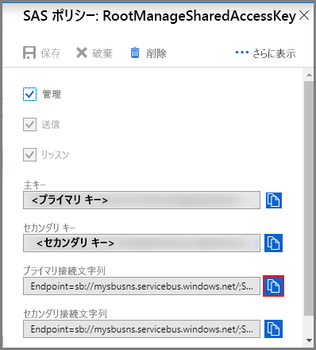

Azure の Service Bus メッセージング エンティティを使用するには、Azure 全体で一意となる名前を備えた名前空間を最初に作成しておく必要があります。 名前空間は、アプリケーション内で Service Bus リソースをアドレス指定するためのスコープ コンテナーを提供します。

名前空間を作成するには:

1. [Azure ポータル](https://portal.azure.com)
2. ポータルの左側のナビゲーション ウィンドウで、**[+ リソースの作成]**、**[統合]**、**[Service Bus]** の順に選択します。

    ![[リソースの作成] -> [統合] -> [Service Bus]](./media/service-bus-create-namespace-portal/create-resource-service-bus-menu.png)
3. **[名前空間の作成]** ダイアログで、次の手順を実行します。 
    1. **名前空間の名前**を入力します。 その名前が使用できるかどうかがすぐに自動で確認されます。
    2. 名前空間の価格レベル (Basic、Standard、Premium) を選択します。 [トピックとサブスクリプション](../articles/service-bus-messaging/service-bus-queues-topics-subscriptions.md#topics-and-subscriptions)を使用する場合は、Standard または Premium を選択してください。 Basic 価格レベルでは、トピック/サブスクリプションはサポートされていません。
    3. **Premium** 価格レベルを選択した場合は、次の手順を実行します。 
        1. **メッセージング ユニット**の数を指定します。 Premium レベルでは、各ワークロードが分離した状態で実行されるように、CPU とメモリのレベルでリソースが分離されます。 このリソースのコンテナーをメッセージング ユニットと呼びます。 各 Premium 名前空間には、1 つ以上のメッセージング ユニットが割り当てられます。 Service Bus の Premium 名前空間ごとに、1 個、2 個、または 4 個のメッセージング ユニットを選択できます。 詳細については、[Service Bus の Premium メッセージング](../articles/service-bus-messaging/service-bus-premium-messaging.md)に関するページをご覧ください。
        2. 名前空間を**ゾーン冗長**にするかどうかを指定します。 ゾーン冗長により、追加コストなしで 1 つのリージョン内の可用性ゾーンをまたいでレプリカを配置することで、可用性を高めることができます。 詳細については、[Azure の Availability Zones](../articles/availability-zones/az-overview.md) に関するページをご覧ください。
    4. **[サブスクリプション]** で、名前空間を作成する Azure サブスクリプションを選択します。
    5. **[リソース グループ]** で、名前空間を追加する既存のリソース グループを選択するか、新しいリソース グループを作成します。      
    6. **[場所]** で、名前空間をホストするリージョンを選択します。
    7. **作成**を選択します。 これで、システムによってサービス名前空間が作成され、有効になります。 システムがアカウントのリソースを準備し 終わるまでに、数分間かかる場合があります。
   
        ![[名前空間の作成]](./media/service-bus-create-namespace-portal/create-namespace.png)
4. Service Bus 名前空間が正常にデプロイされていることを確認します。 通知を確認するには、ツール バーの**ベルのアイコン (アラート)** を選択します。 次の図に示すように、通知内の**リソース グループの名前**を選択します。 Service Bus 名前空間を含むリソース グループが表示されます。

    
5. このリソース グループの **[リソース グループ]** ページで、**Service Bus 名前空間**を選択します。 

    ![[リソース グループ] ページ - Service Bus 名前空間を選択する](./media/service-bus-create-namespace-portal/resource-group-select-service-bus.png)
6. Service Bus 名前空間のホーム ページが表示されます。 

    

### 管理資格情報を取得する
新しい名前空間を作成すると、Shared Access Signature (SAS) の初期規則が自動的に生成され、あらゆる角度から名前空間を完全に制御することを可能にするプライマリ キーとセカンダリ キーのペアが関連付けられます。 通常の送信者と受信者を対象に、より権限を制限した規則を作成する方法については、「[Service Bus の認証と承認](../articles/service-bus-messaging/service-bus-authentication-and-authorization.md)」をご覧ください。 名前空間のプライマリ キーとセカンダリ キーをコピーするには、次の手順を実行します。 

1. **[すべてのリソース]** で、新しく作成した名前空間の名前をクリックします。
2. 名前空間ウィンドウで、**[共有アクセス ポリシー]** をクリックします。
3. **[共有アクセス ポリシー]** 画面で、**[RootManageSharedAccessKey]** をクリックします。
   
    
4. **[ポリシー:RootManageSharedAccessKey]** ウィンドウで、**[プライマリ接続文字列]** の横にあるコピー ボタンをクリックし、後で使用するために接続文字列をクリップボードにコピーします。 この値をメモ帳などに一時的に貼り付けます。
   
    
5. 前の手順を繰り返し、**[プライマリ キー]** の値をコピーして、後で使用するために一時的な場所に貼り付けます。

<!--Image references-->

