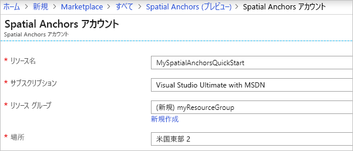

## Spatial Anchors リソースを作成する

1. <a href="https://portal.azure.com" target="_blank">Azure Portal</a> に移動します。

2. Azure portal の左側のメニューから **[リソースの作成]** を選択します。

3. 検索バーで「Spatial Anchors」を検索します。

   

4. **[Spatial Anchors (プレビュー)]** を選択してダイアログを開き、**[作成]** を選択します。

5. **[Spatial Anchors アカウント]** フォームで以下を行います。

   1. 一意のリソース名を指定します。
   2. リソースをアタッチするサブスクリプションを選択します。
   3. **[新規作成]** を選択してリソース グループを作成し、リソース グループに **[myResourceGroup]** という名前を付け、**[OK]** を選択します。
      [!INCLUDE [resource group intro text](resource-group.md)]
   4. リソースが配置される場所 (リージョン) を選択します。
   5. **[新規]** を選択して、リソースの作成を開始します。

   

6. リソースの作成が正常に完了したら、リソースのプロパティを表示できます。 後で必要なので、リソースの **[アカウント ID]** 値をメモしておきます。

   

7. **[設定]** の下の **[キー]** を選択し、**[プライマリ キー]** 値をメモしておきます。 この値は `Account Key` であり、後で使用されます。

   
