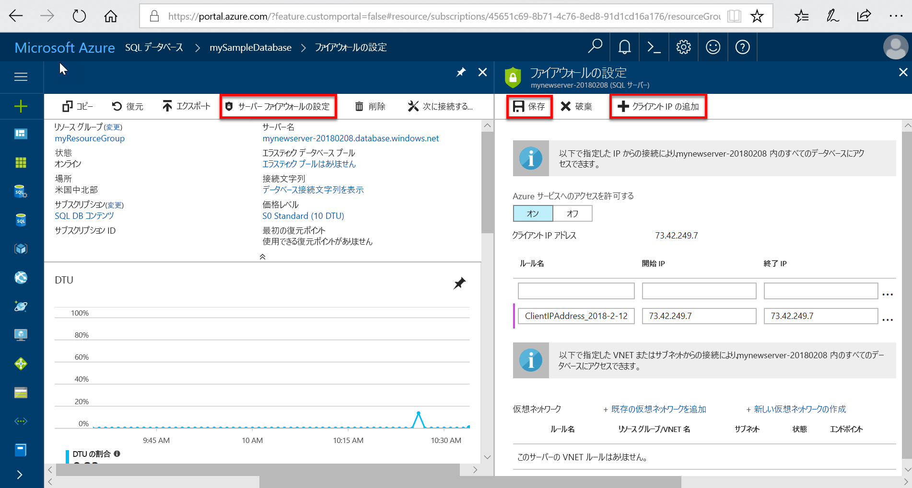

## Azure ポータルにサインインします。

[Azure Portal](https://portal.azure.com/) にサインインします。

## 空の SQL データベースを作成する

Azure SQL データベースは、定義済みの一連の[コンピューティング リソースとストレージ リソース](../articles/sql-database/sql-database-service-tiers-dtu.md)を使って作成されます。 データベースは、[Azure リソース グループ](../articles/azure-resource-manager/resource-group-overview.md)内と [Azure SQL Database 論理サーバー](../articles/sql-database/sql-database-features.md)内に作成されます。 

空の SQL Database を作成するには、次の手順に従います。 

1. Azure Portal の左上隅にある **[リソースの作成]** をクリックします。

2. **[新規]** ページから **[データベース]** を選択し、**[新規]** ページの **[SQL Database]** で **[作成]** を選択します。

   

3. 前の画像で示されているように、[SQL Database] のフォームに次の情報を入力します。   

   | Setting       | 推奨値 | 説明 | 
   | ------------ | ------------------ | ------------------------------------------------- | 
   | **[データベース名]** | mySampleDatabase | 有効なデータベース名については、「[Database Identifiers (データベース識別子)](https://docs.microsoft.com/sql/relational-databases/databases/database-identifiers)」を参照してください。 | 
   | **サブスクリプション** | 該当するサブスクリプション  | サブスクリプションの詳細については、[サブスクリプション](https://account.windowsazure.com/Subscriptions)に関するページを参照してください。 |
   | **[リソース グループ]** | myResourceGroup | 有効なリソース グループ名については、[名前付け規則と制限](https://docs.microsoft.com/azure/architecture/best-practices/naming-conventions)に関するページを参照してください。 |
   | **[ソースの選択]** | 空のデータベース | 空のデータベースを作成するように指定します。 |

4. **[サーバー]** をクリックして、新しいデータベース用の新しいサーバーを作成して構成します。 **[新しいサーバー]** フォームには次の情報を入力してください。 

   | Setting       | 推奨値 | 説明 | 
   | ------------ | ------------------ | ------------------------------------------------- | 
   | **サーバー名** | グローバルに一意の名前 | 有効なサーバー名については、[名前付け規則と制限](https://docs.microsoft.com/azure/architecture/best-practices/naming-conventions)に関するページを参照してください。 | 
   | **サーバー管理者ログイン** | 有効な名前 | 有効なログイン名については、「[Database Identifiers (データベース識別子)](https://docs.microsoft.com/sql/relational-databases/databases/database-identifiers)」を参照してください。|
   | **パスワード** | 有効なパスワード | パスワードには 8 文字以上が使用され、大文字、小文字、数字、英数字以外の文字のうち、3 つのカテゴリの文字が含まれている必要があります。 |
   | **場所** | 有効な場所 | リージョンについては、「[Azure リージョン](https://azure.microsoft.com/regions/)」を参照してください。 |

   

5. **[選択]** をクリックします。

6. **[価格レベル]** をクリックして、サービス レベル、DTU 数、ストレージの容量を指定します。 DTU の量とストレージの容量に関して、サービス レベルごとに利用できるオプションを調べます。 

7. このチュートリアルでは、**Standard** サービス レベルを選択したうえで、スライダーを使用して **100 DTU (S3)** と **400** GB のストレージを選択します。

   

8. プレビューの使用条件に同意して、**[Add-on Storage]\(アドオン ストレージ\)** オプションを使用します。 

   > [!IMPORTANT]
   > \* 付属のストレージ容量を超えるストレージ サイズはプレビュー段階であり、追加料金が適用されます。 詳細については、「 [SQL Database の価格](https://azure.microsoft.com/pricing/details/sql-database/)」をご覧ください。 
   >
   >\* Premium レベルでは現在、次のリージョンで 1 TB を超えるストレージが使用できます: カナダ中部、カナダ東部、フランス中部、ドイツ中部、東日本、韓国中部、米国中南部、東南アジア、米国東部 2、米国西部、米国政府バージニア、および西ヨーロッパ。 [P11 ～ P15 の現時点での制限](../articles/sql-database/sql-database-dtu-resource-limits-single-databases.md#single-database-limitations-of-p11-and-p15-when-the-maximum-size-greater-than-1-tb)に関するページを参照してください。  
   > 

9. サーバーのレベル、DTU 数、ストレージの容量を選択したら、**[適用]** をクリックします。  

10. 空のデータベースの**照合順序**を選択します (このチュートリアルでは既定値を使用)。 照合順序の詳細については、「[Collations (照合順序)](https://docs.microsoft.com/sql/t-sql/statements/collations)」を参照してください。

11. **[作成]** をクリックしてデータベースをプロビジョニングします。 プロビジョニングの完了には 1 分 30 秒程度かかります。 

12. ツール バーの **[通知]** をクリックして、デプロイ プロセスを監視します。
    
     

## サーバーレベルのファイアウォール規則を作成する

SQL Database サービスは、外部のアプリケーションやツールに、サーバーまたはサーバー上のすべてのデータベースへの接続を禁止するファイアウォールをサーバーレベルで作成します。それらに接続するためには、特定の IP アドレスに対してファイアウォールを開放するファイアウォール規則が作成されている必要があります。 以下の手順に従い、クライアントの IP アドレスに対して [SQL Database サーバーレベルのファイアウォール規則](../articles/sql-database/sql-database-firewall-configure.md)を作成し、その IP アドレスのみに SQL Database ファイアウォールを介して外部接続できるようにします。 

> [!NOTE]
> SQL Database の通信は、ポート 1433 上で行われます。 企業ネットワーク内から接続しようとしても、ポート 1433 での送信トラフィックがネットワークのファイアウォールで禁止されている場合があります。 その場合、会社の IT 部門によってポート 1433 が開放されない限り、Azure SQL Database サーバーに接続することはできません。
>

1. デプロイが完了したら、左側のメニューから **[SQL データベース]** をクリックし、**SQL データベース** ページで、**mySampleDatabase** をクリックします。 データベースの概要ページが開き、完全修飾サーバー名 (**mynewserver20170824.database.windows.net** など) や追加の構成オプションが表示されます。 

2. この完全修飾サーバー名をコピーします。以降のクイック スタートでサーバーとそのデータベースに接続する際に必要となります。 

    

3. ツール バーで **[Set server firewall]\(サーバー ファイアウォールの設定\)** をクリックします。 SQL Database サーバーの **[ファイアウォール設定]** ページが開きます。 

    

4. ツール バーの **[クライアント IP の追加]** をクリックし、現在の IP アドレスをファイアウォール規則に追加します。 ファイアウォール規則は、単一の IP アドレスまたは IP アドレスの範囲に対して、ポート 1433 を開くことができます。

5. **[Save]** をクリックします。 論理サーバーでポート 1433 を開いている現在の IP アドレスに対して、サーバーレベルのファイアウォール規則が作成されます。

6. **[OK]** をクリックし、**[ファイアウォール設定]** ページを閉じます。

これで、SQL Server Management Studio やその他のツールを使用して、SQL Database サーバーとそのデータベースに、前に作成したサーバー管理者アカウントでこの IP アドレスから接続できるようになりました。

> [!IMPORTANT]
> 既定では、すべての Azure サービスで、SQL Database ファイアウォール経由のアクセスが有効になります。 すべての Azure サービスに対して無効にするには、このページの **[オフ]** をクリックします。

## SQL Server の接続情報

Azure Portal で、Azure SQL Database サーバーの完全修飾サーバー名を取得します。 その完全修飾サーバー名は、SQL Server Management Studio でのサーバーへの接続に使用します。

1. [Azure Portal](https://portal.azure.com/) にサインインします。
2. 左側のメニューから **[SQL データベース]** を選択し、**[SQL データベース]** ページで目的のデータベースをクリックします。 
3. そのデータベースの Azure Portal ページの **[要点]** ウィンドウで、**サーバー名**を見つけてコピーします。

   
