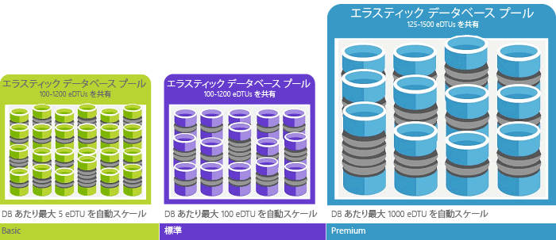

データベース スループット ユニット (DTU) は、データベースが動作するハードウェアの制約を考慮してデータベースの相対的なトランザクション処理能力を表す SQL Database のメジャーの単位です。DTU は、自動車の馬力に似た概念です。あるデータベースの別のデータベースに対する相対的なパフォーマンスを記述するものです。自動車の馬力と同じように、DTU が大きいほどデータベースは高い能力を備えています。馬力は、重量、エンジン排気量、ターボ、排気システムなど、さまざまな要素の関数です。同様に、DTU は、データベースが使用できるメモリ、コンピューティング 、ディスクの量と種類の関数です。DTU の決定方法の詳細については、「[Azure SQL データベースのベンチマークの概要](https://msdn.microsoft.com/library/azure/dn741327.aspx)」を参照してください。

例: Basic データベースは 5 DTU であり、これは Premium P11 データベースの 1750 DTU と比較して非常に低いトランザクション スループット能力であることを示します。

単一のデータベースの DTU は、エラスティック データベースの eDTU に直接変換されます。たとえば、Basic エラスティック データベース プール内のデータベースが最大 5 eDTU を提供するとします。これは、Basic 単一データベースと同等のパフォーマンスです。違いは、エラスティック データベースは必要になるまでプールの eDTU を使用しない点です。

単純な例を次に示します。1000 DTU の Basic エラスティック データベース プールがあるとします。プール内には 800 個のデータベースがあります。同時に使用されているデータベースが 800 個中 200 個のデータベースのみであれば (5 DTU X 200 = 1000)、プールの上限を超えることはなく、データベースのパフォーマンスは低下しません。この例は、わかりやすくするために単純化しています。実際には、もう少し複雑な計算が行われます。ポータルでは自動計算され、データベースの使用履歴に基づいて推奨が表示されます。推奨のしくみと自分で計算する方法については、「[エラスティック データベース プールの価格およびパフォーマンスに関する考慮事項](../articles/sql-database/sql-database-elastic-pool-guidance.md)」を参照してください。

<!---HONumber=Oct15_HO3-->