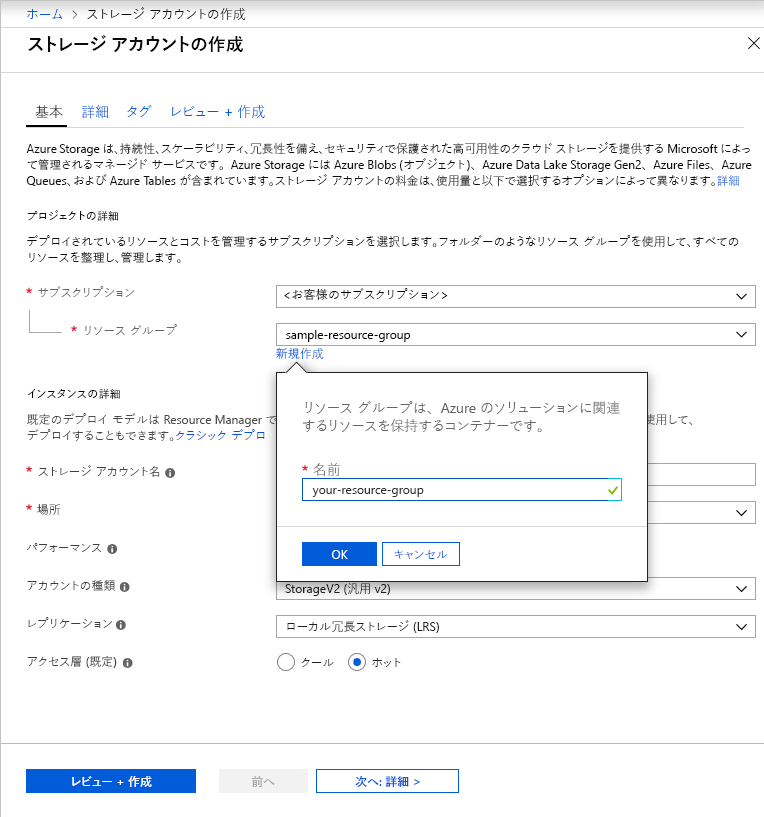

Azure Portal で汎用 v2 ストレージ アカウントを作成するには、次の手順に従います。

1. Azure Portal で左側のメニューを展開してサービスのメニューを開き、**[すべてのサービス]** を選択します。 次に、下へスクロールして **[ストレージ]** の **[ストレージ アカウント]** を選択します。 表示された **[ストレージ アカウント]** ウィンドウで **[追加]** を選択します。
1. ストレージ アカウントを作成するサブスクリプションを選択します。
1. **[リソース グループ]** フィールドの下の **[新規作成]** をクリックします。 次の図のように、新しいリソース グループの名前を入力します。

    

1. 次に、ストレージ アカウントの名前を入力します。 選択する名前は、Azure 全体で一意であり、長さは 3 ～ 24 文字でなければならず、数字と小文字のみを使用できます。
1. ストレージ アカウントの場所を選択するか、または既定の場所を使います。
1. 以下のフィールドは既定値に設定されたままにします。
    - **[デプロイ モデル]** フィールドは、既定では **[Resource Manager]** に設定されています。
    - **[パフォーマンス]** フィールドは、既定では **[Standard]** に設定されています。
    - **[アカウントの種類]** フィールドは、既定では **[StorageV2 (汎用 v2)]** に設定されています。
    - **[レプリケーション]** フィールドは、既定では **[ローカル冗長ストレージ (LRS)]** に設定されています。
    - **[アクセス レベル]** は、既定では **[ホット]** に設定されています。

1. **[確認および作成]** をクリックして、ストレージ アカウントの設定を確認し、アカウントを作成します。
1. **Create** をクリックしてください。

ストレージ アカウントの種類およびその他のストレージ アカウントの設定について詳しくは、「[Azure ストレージ アカウントの概要](https://docs.microsoft.com/azure/storage/common/storage-account-overview)」をご覧ください。 リソース グループの詳細については、「[Azure Resource Manager の概要](https://docs.microsoft.com/azure/azure-resource-manager/resource-group-overview)」をご覧ください。 
