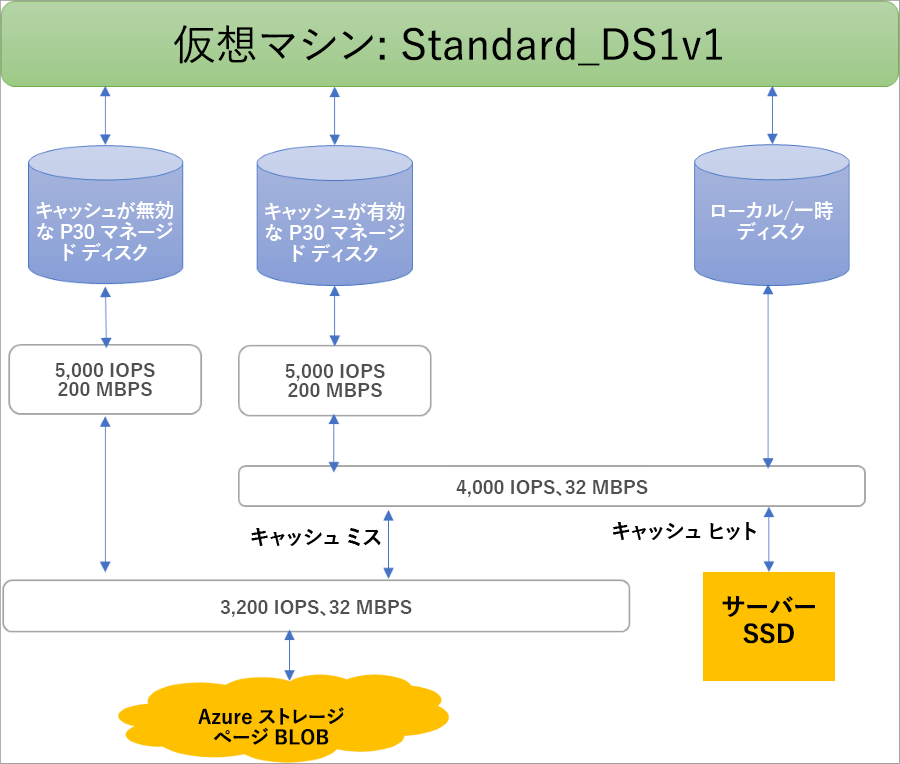

## マネージド ディスクの利点

マネージド ディスクを使用することによって得られる利点をいくつか紹介します。

### 優れた持続性と可用性

マネージド ディスクは、99.999% の可用性で設計されています。 マネージド ディスクは、データの 3 つのレプリカを提供し、高い持続性を可能にすることで、これを実現しています。 1 つのレプリカに問題が発生しても (またはそれが 2 つのレプリカであっても)、残りのレプリカでデータを維持し、高い耐障害性を確保します。 このアーキテクチャにより、Azure はサービスとしてのインフラストラクチャ (IaaS) ディスクのエンタープライズ レベルの持続性を、業界トップレベルの年間故障率 0% で一貫して提供できます。

### シンプルでスケーラブルな VM のデプロイ

マネージド ディスクでは、サブスクリプション内の特定の種類の VM **ディスク**をリージョンあたり最大 50,000 個まで作成できるので、1 つのサブスクリプションで数千台の **VM** を作成できます。 また、この機能により、Marketplace のイメージを使用して[仮想マシン スケール セット](../articles/virtual-machine-scale-sets/virtual-machine-scale-sets-overview.md)に最大 1,000 台の VM を作成することが可能となるため、仮想マシン スケール セットのスケーラビリティがさらに向上します。

### 可用性セットとの統合

マネージド ディスクは可用性セットと統合されており、[可用性セット内の VM](../articles/virtual-machines/windows/manage-availability.md#use-managed-disks-for-vms-in-an-availability-set) のディスクが単一障害点にならないように相互に十分に分離されます。 ディスクはさまざまなストレージ スケール ユニット (スタンプ) に自動的に配置されます。 ハードウェアやソフトウェアの障害によってスタンプが機能しなくなった場合、そのスタンプ上のディスクを使用する VM インスタンスだけが機能しなくなります。 たとえば、5 台の VM 上で実行されているアプリケーションがあり、これらの VM が可用性セットに含まれているとします。 各 VM のディスクはすべて同じスタンプに格納されるわけではないため、1 つのスタンプがダウンしても、アプリケーションの他のインスタンスは引き続き実行されます。

### Availability Zones との統合

マネージド ディスクでは [Availability Zones](../articles/availability-zones/az-overview.md) をサポートします。これは高可用性を備えたサービスであり、アプリケーションをデータセンターの障害から保護します。 Availability Zones は、Azure リージョン内の一意の物理的な場所です。 それぞれのゾーンは、独立した電源、冷却手段、ネットワークを備えた 1 つまたは複数のデータセンターで構成されています。 回復性を確保するため、有効になっているリージョンにはいずれも最低 3 つのゾーンが別個に存在しています。 Availability Zones では、Azure によって業界最高の 99.99% VM アップタイム SLA が実現されます。

### Azure Backup のサポート

リージョン全体の災害から保護するために、[Azure Backup](../articles/backup/backup-overview.md) を使用し、時間ベースのバックアップとバックアップ保存ポリシーを指定してバックアップ ジョブを作成できます。 こうすることで、簡単な VM の復元を任意で実行できます。 現在、Azure Backup では、最大 4 テビバイト (TiB) のディスク サイズがサポートされています。  Azure Backup では、マネージド ディスクのバックアップと復元がサポートされます。 Azure VM バックアップ サポートについて[詳しく確認します](../articles/backup/backup-support-matrix-iaas.md)。

### 詳細なアクセス制御

[Azure のロールベースのアクセス制御 (RBAC)](../articles/role-based-access-control/overview.md) を使用して、マネージド ディスクに対する特定のアクセス許可を 1 人以上のユーザーに割り当てることができます。 マネージド ディスク では、ディスクの読み取り、書き込み (作成/更新)、削除、[Shared Access Signature (SAS) URI](../articles/storage/common/storage-dotnet-shared-access-signature-part-1.md) の取得など、さまざまな操作を公開しています。 ユーザーが仕事をする上で必要な操作へのアクセス権だけを付与することができます。 たとえば、ユーザーが管理ディスクをストレージ アカウントにコピーすることが望ましくない場合は、その管理ディスクに対するエクスポート アクションへのアクセス権を付与しないようにします。 同様に、ユーザーが SAS URI を使用してマネージド ディスクをコピーできないようにする場合は、そのマネージド ディスクに対する該当のアクセス許可を付与しないことを選択できます。

### お使いの VHD をアップロードする

 直接アップロードを使用して、お使いの VHD を Azure マネージド ディスクに簡単に転送できます。 以前は、ストレージ アカウントへのデータのステージングを含む複雑なプロセスを実行する必要がありました。 現在、手順は少なくなっています。 オンプレミスの VM の Azure へのアップロードや大規模なマネージド ディスクへのアップロードはもっと簡単になり、バックアップと復元のプロセスが簡素化されています。 また、VM へのアタッチなしで、マネージド ディスクに直接データをアップロードできることでコストが削減されます。 直接アップロードを使用して、最大 32 TiB の VHD をアップロードできます。

 VHD を Azure に転送する方法については、[CLI](../articles/virtual-machines/linux/disks-upload-vhd-to-managed-disk-cli.md) または [PowerShell](../articles/virtual-machines/windows/disks-upload-vhd-to-managed-disk-powershell.md) の記事を参照してください。

## 暗号化

マネージド ディスクには、2 種類の暗号化が用意されています。 1 つ目は、ストレージ サービスによって実行される Storage Service Encryption (SSE) です。 2 つ目は、OS と VM 用データ ディスクで有効にできる Azure Disk Encryption (ADE) です。

### Storage Service Encryption (SSE)

[Azure Storage Service Encryption](../articles/storage/common/storage-service-encryption.md) は、保管データの暗号化を提供し、データの安全性を保護して組織のセキュリティおよびコンプライアンス要件を満たします。 SSE は、マネージド ディスクを使用できるすべてのリージョンのすべてのマネージド ディスク、スナップショット、イメージに対して既定で有効になっています。 詳細については、「[マネージド ディスクに関する FAQ ページ](../articles/virtual-machines/windows/faq-for-disks.md#managed-disks-and-storage-service-encryption)」を参照してください。

### Azure Disk Encryption

Azure Disk Encryption を使用すると、IaaS 仮想マシンで使用される OS とデータ ディスクを暗号化できます。 この暗号化にはマネージド ディスクが含まれます。 Windows の場合、ドライブの暗号化には、業界標準の BitLocker 暗号化テクノロジが使用されます。 Linux の場合、ディスクの暗号化には DM-Crypt テクノロジが使用されます。 暗号化プロセスは Azure Key Vault と統合されているので、ディスクの暗号化キーを制御および管理できます。 詳細については、[IaaS VM のための Azure Disk Encryption](../articles/security/azure-security-disk-encryption-overview.md) に関するページを参照してください。

## ディスク ロール

Azure には、データ ディスク、OS ディスク、一時ディスクという 3 つのメイン ディスク ロールがあります。 これらのロールは、ご利用の仮想マシンに接続されているディスクにマップされます。

### データ ディスク

データ ディスクは仮想マシンに取り付けられるマネージド ディスクであり、ユーザーが保存しておく必要があるアプリケーションなどのデータを格納するためのものです。 データ ディスクは SCSI ドライブとして登録され、ユーザーが選択した文字のラベルが付けられます。 各データ ディスクの最大容量は 32,767 ギビバイト (GiB) です。 仮想マシンのサイズにより、そこに取り付けできるデータ ディスクの数と、ディスクをホストするために使用できるストレージの種類が決まります。

### OS ディスク

どの仮想マシンにも 1 つのオペレーティング システム ディスクが取り付けられています。 その OS ディスクには、VM の作成時に選択された OS がプリインストールされています。

このディスクの最大容量は 2,048 GiB です。

### 一時ディスク

すべての VM には一時ディスクがありますが、これはマネージド ディスクではありません。 一時ディスクは、アプリケーションとプロセスのための一時的なストレージを提供し、ページ ファイルやスワップ ファイルなどのデータのみを格納するためのものです。 一時ディスクのデータは、[メンテナンス イベント](../articles/virtual-machines/windows/manage-availability.md?toc=%2fazure%2fvirtual-machines%2fwindows%2ftoc.json#understand-vm-reboots---maintenance-vs-downtime) イベント中、または [VM の再デプロイ](../articles/virtual-machines/troubleshooting/redeploy-to-new-node-windows.md?toc=%2Fazure%2Fvirtual-machines%2Fwindows%2Ftoc.json)時に失われる可能性があります。 Azure Linux VM の一時ディスクは既定で /dev/sdb です。Windows VM の一時ディスクは既定で D: です。 VM の標準の再起動が正常に実行されている間、一時ディスクのデータは保持されます。

## マネージド ディスクのスナップショット

マネージド ディスクのスナップショットは、マネージド ディスクの読み取り専用のクラッシュ整合性の完全なコピーであり、既定で Standard マネージド ディスクとして格納されます。 スナップショットを使用すると、任意の時点のマネージド ディスクのバックアップを作成できます。 これらのスナップショットはソース ディスクとは独立して存在し、新しいマネージド ディスクの作成に使用できます。 

スナップショットは、使用されるサイズに基づいて請求されます。 たとえば、64 GiB のプロビジョニング済み容量でマネージド ディスクのスナップショットを作成し、実際に使用されたデータ サイズが 10 GiB である場合、スナップショットは使用されたデータ サイズである 10 GiB 分のみ課金されます。 スナップショットの使用サイズは、[Azure 利用状況レポート](https://docs.microsoft.com/en-us/azure/billing/billing-understand-your-bill)で確認できます。 たとえば、スナップショットの使用データ サイズが 10 GiB の場合、利用状況レポートには、使用量として 10 GiB/(31 日 x 24 時間) = 0.013441 GiB が表示されます。

マネージド ディスクでスナップショットを作成する方法の詳細については、次のリソースを参照してください。

* [Windows のスナップショットを使用してマネージド ディスクとして格納された VHD のコピーを作成する](../articles/virtual-machines/windows/snapshot-copy-managed-disk.md)
* [Linux のスナップショットを使用してマネージド ディスクとして格納された VHD のコピーを作成する](../articles/virtual-machines/linux/snapshot-copy-managed-disk.md)

### イメージ

マネージド ディスクでは、マネージド カスタム イメージの作成もサポートしています。 イメージは、ストレージ アカウント内のカスタム VHD から作成することも、一般化された (sysprep 済み) VM から直接作成することもできます。 このプロセスでは単一イメージもキャプチャされます。 このイメージには、OS ディスクとデータ ディスクの両方を含め、VM に関連付けられているすべてのマネージド ディスクが含まれます。 このマネージド カスタム イメージにより、ストレージ アカウントのコピーや管理を必要とせずに、カスタム イメージを使用して数百台の VM を作成できます。

イメージの作成方法については、次の記事をご覧ください。

* [Azure の汎用化された VM の管理対象イメージをキャプチャする方法](../articles/virtual-machines/windows/capture-image-resource.md)
* [Azure CLI を使用して Linux 仮想マシンを一般化してキャプチャする方法](../articles/virtual-machines/linux/capture-image.md)

#### イメージとスナップショット

イメージとスナップショットの違いを理解しておくことが重要です。 マネージド ディスクでは、割り当てが解除された、汎用化された VM のイメージを取得できます。 このイメージには、VM に接続されているすべてのディスクが含まれます。 このイメージを使用して VM を作成できます。作成された VM にはすべてのディスクが含まれます。

スナップショットは、スナップショットの作成時点のディスクのコピーです。 1 つのディスクにのみ適用されます。 VM が使用しているディスク (OS ディスク) が 1 つの場合、スナップショットまたはイメージを作成し、そのスナップショットまたはイメージから VM を作成できます。

スナップショットは、含まれているディスク以外のディスクを認識していません。 このため、ストライピングなど、複数のディスクの調整が必要なシナリオで使用するには問題があります。 スナップショットには相互に調整する機能が必要ですが、これは現在サポートされていません。

## ディスクの割り当てとパフォーマンス

次の図は、3 レベルのプロビジョニング システムを使用して、ディスクの帯域幅と IOPS がリアルタイムに割り当てられていることを示しています。

第 1 レベルのプロビジョニングでは、ディスクごとの IOPS と帯域幅の割り当てを設定します。  第 2 レベルでは、コンピューティング サーバーで SSD プロビジョニングが実装されます。これは、キャッシュ (読み取り/書き込み、読み取り専用) が有効なディスクと、ローカル ディスクと一時ディスクを含む、サーバーの SSD に格納されているデータに対してのみ適用されます。 最後に、第 3 レベルとして VM ネットワークがプロビジョニングされます。これは、コンピューティング ホストで Azure Storage のバックエンドに送信されるすべての I/O に対して適用されます。 このスキームでは、VM でのローカル SSD の使用方法、アタッチされているディスクの数、およびアタッチされているディスクのパフォーマンスやキャッシュの種類といったさまざまな要素によって、VM のパフォーマンスが決まります。

これらの制限の例として、Standard_DS1v1 の VM では、SSD とネットワーク レベルの制限により、キャッシュの設定が有効か無効かにかかわらず、P30 のディスクの 5,000 IOPS を達成することはできません。

Azure では、ディスク トラフィックに優先順位が付けられたネットワーク チャネルを使用します。これにより、他の低優先度のネットワーク トラフィックより優先されます。 これは、ネットワークの競合が発生した場合に、ディスクで予想されるパフォーマンスを保持するのに役立ちます。 同様に、Azure Storage では、自動負荷分散により、リソースの競合やその他の問題がバックグラウンドで処理されます。 Azure Storage では、ディスクを作成するときに必要なリソースを割り当て、トラフィック レベルを処理するためにリソースのプロアクティブおよびリアクティブな分散を適用します。 これにより、ディスクで確実に予想される IOPS とスループット ターゲットを維持できるようになります。 必要に応じて、VM レベルとディスク レベルのメトリックを使用して、パフォーマンスと設定のアラートを追跡できます。

目的のパフォーマンスを実現できるように、VM とディスクの構成を最適化するため、[高パフォーマンス用の設計](../articles/virtual-machines/windows/premium-storage-performance.md)に関する記事を参照してください。

## 次の手順

ディスクの種類に関する記事で、Azure が提供する個々のディスクの種類と、ニーズに適した種類について学習し、パフォーマンス ターゲットについて学習します。
