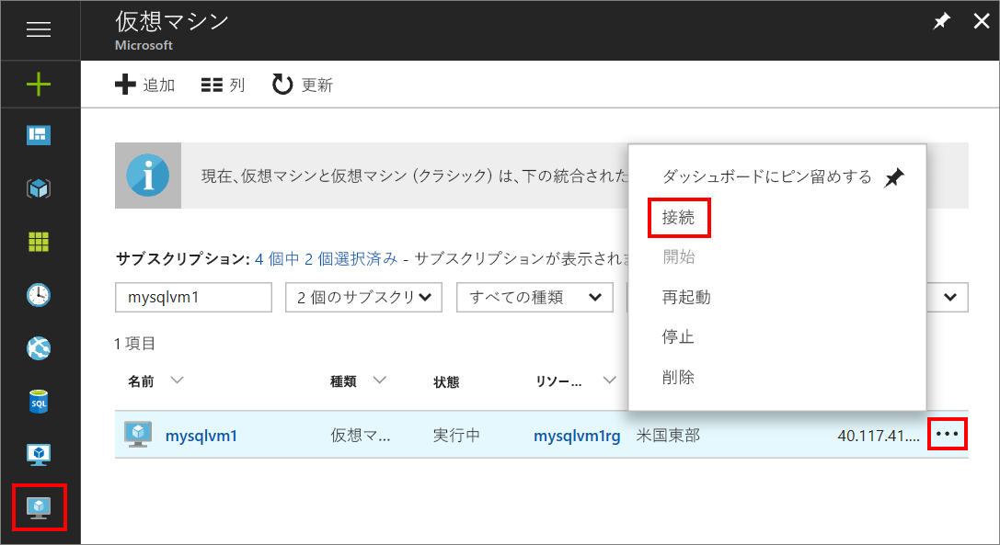

1. Azure 仮想マシンが作成され、実行されてから、Azure Portal の [仮想マシン] アイコンをクリックして、VM を表示します。

1. 新しい VM の省略記号 **[...]** をクリックします。

1. **[接続]** をクリックします。

   

1. ブラウザーによって VM のためにダウンロードされた **RDP** ファイルを開きます。

1. リモート デスクトップ接続で、このリモート接続の発行元が特定できないことが通知されます。 **[接続]** をクリックして続行します。

1. **[Windows セキュリティ]** ダイアログで、**[別のアカウントを使う]** をクリックします。 これを表示するには、**[その他]** をクリックする必要があります。 VM の作成時に構成したユーザー名とパスワードを指定します。 ユーザー名の前にバックスラッシュを追加する必要があります。

   

1. **[OK]** をクリックして接続します。
